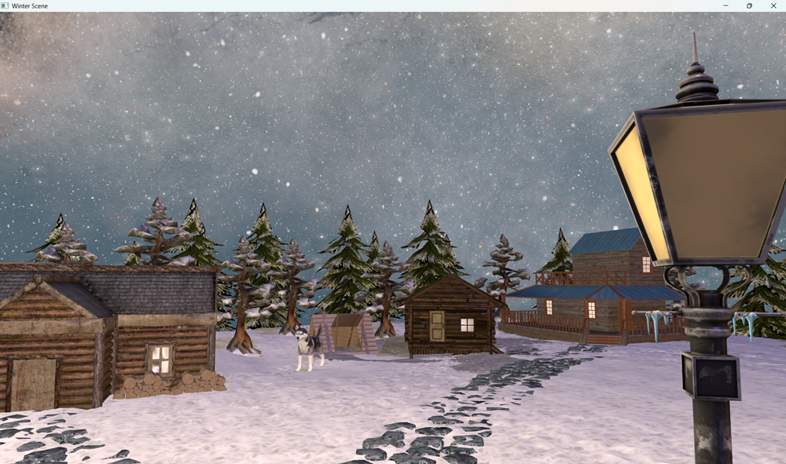
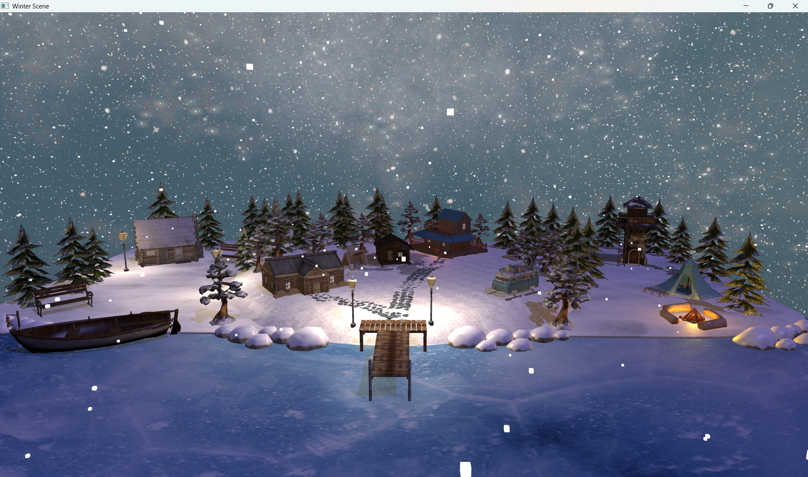
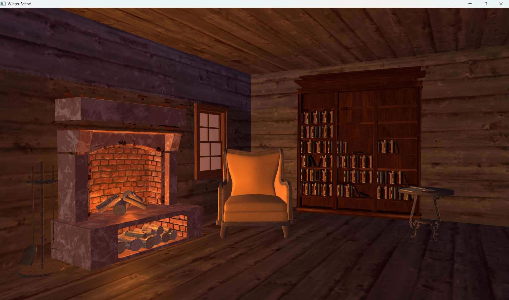

# OpenGL Winter Scene Project

This project is a 3D real-time rendering application developed in C++ using the OpenGL graphics. It was created as part of the Graphic Processing course.

The application features an interactive winter night scene, focusing on the integration of the programmable graphics pipeline and advanced rendering techniques.

## Scene Gallery

  
  

### Interior Detail
The interaction between point light sources (fireplace) and 3D models within the cabin interior.

  

## Features

The implementation utilizes several standard computer graphics solutions and algorithms:

* **Programmable Pipeline:** Vertex and Fragment shaders written in GLSL for geometric transformations and light calculations.
* **Dynamic Lighting (Blinn-Phong):** Implementation of the Blinn-Phong lighting model for enhanced visual realism.
    * **Directional Light:** Simulates moonlight and controls shadow direction.
    * **Point Lights:** Static lanterns and dynamic fire sources with orange and red intensities.
* **Dynamic Shadows:** Real-time shadow generation using the Shadow Mapping technique.
* **Atmospheric Effects:**
    * **Particle System:** Real-time snow simulation with physics properties updated on the CPU.
    * **Linear Fog:** Efficient shader-based fog implementation to create a winter atmosphere.
* **Models and Animations:** Integration of complex 3D models exported from Blender, including simple animations for characters (husky tail rotation).

## User Manual

| Key | Action |
| :--- | :--- |
| W, A, S, D | Move camera horizontally (Forward, Left, Back, Right) |
| Q, E | Rotate camera left/right |
| Z, X | Move camera Up/Down |
| Mouse | Look around |
| F | Toggle atmospheric fog effect |
| G | Toggle snow particle system |
| T / Y | Switch between Solid / Wireframe / Point rendering modes |
| J, L | Rotate directional light (Change light angle) |
| M | Toggle point lights (Lanterns) |
| N | Toggle global light (Moonlight) |
| I | Toggle husky animation |
| O | Start/Stop automatic scene presentation |
| V | Toggle light debug mode |
| ESC | Exit application |
